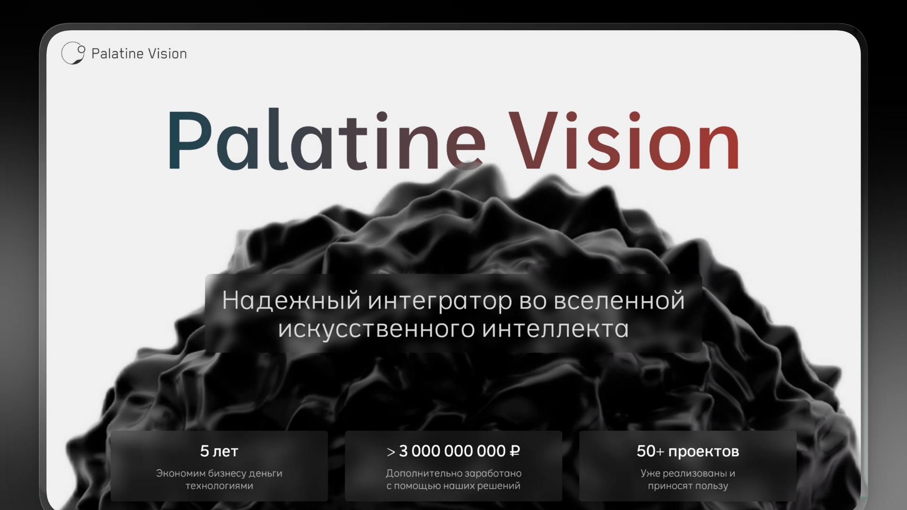

# Palatine Vision / GPU Benchmark для LLM



Инструментарий для бенчмаркинга производительности GPU при инференсе больших языковых моделей с использованием vLLM.

## Измеряемые метрики

- **TTFT** (Time To First Token) — время до получения первого токена
- **TPOT** (Time Per Output Token) — время генерации одного токена
- **Throughput** — пропускная способность (токены/сек)
- **Latency percentiles** — перцентили задержки (P50, P90, P99)

## Требования

- Docker и Docker Compose
- NVIDIA GPU с поддержкой CUDA
- NVIDIA Container Toolkit

## Быстрый старт

### 1. Выбор модели для тестирования

Определитесь с LLM моделью, которую хотите протестировать (например, `Qwen/Qwen3-4B`, `Qwen/Qwen3-4B-FP8`).

### 2. Настройка vLLM серверов

Отредактируйте `docker-compose.yml`, указав модель и параметры запуска в секции `vllm-server`:

```yaml
vllm-server:
  ...
  command: >
    vllm serve Qwen/Qwen3-4B
    --port 8000
    --dtype bfloat16
    --max-model-len 32000
    --gpu-memory-utilization 0.9
    --disable-log-requests
```

**Основные параметры:**
- Имя модели (первый аргумент после `vllm serve`)
- `--port` — порт сервера
- `--dtype` — тип данных (`bfloat16`, `float16`, `auto`)
- `--max-model-len` — максимальная длина контекста
- `--gpu-memory-utilization` — доля используемой памяти GPU

**Тестирование нескольких конфигураций:**

Можно запустить несколько vLLM серверов одновременно для сравнения (например, одну модель в bf16 и другую в fp8). В `docker-compose.yml` уже есть пример с двумя серверами:

```yaml
vllm-server:
  ...
  command: vllm serve Qwen/Qwen3-4B --port 8000 --dtype bfloat16 ...

vllm-server-fp8:
  ...
  command: vllm serve Qwen/Qwen3-4B-FP8 --port 8001 --dtype auto ...
```

Если вам нужен только один сервер, закомментируйте второй и уберите его из `depends_on` сервиса `benchmark`.

### 3. Настройка параметров бенчмарка

Отредактируйте `benchmark_config.json`:

```json
{
    "models": [
        {"name": "Qwen/Qwen3-4B", "host": "http://vllm-server", "port": 8000, "metadata": "RTX5090"},
        {"name": "Qwen/Qwen3-4B-FP8", "host": "http://vllm-server-fp8", "port": 8001, "metadata": "RTX5090"}
    ],
    "max_concurrency_values": [1, 5, 10, 20, 30, 40, 50, 60, 70, 80, 90, 100],
    "num_prompts": 50,
    "input_lengths": [32000],
    "output_lengths": [1024],
    "dataset_name": "custom",
    "dataset_path": [
      "/palatine/workspace/dataset/low_context_chat.jsonl",
      "/palatine/workspace/dataset/middle_context_rag.jsonl",
      "/palatine/workspace/dataset/long_context_rag.jsonl"
    ],
    "timeout": 600
}
```

**Описание параметров:**

| Параметр                 | Описание                                                               |
|--------------------------|------------------------------------------------------------------------|
| `models`                 | Список моделей для тестирования                                        |
| `models[].name`          | Имя модели (должно совпадать с указанным в vLLM сервере)               |
| `models[].host`          | Хост vLLM сервера (имя сервиса в docker-compose)                       |
| `models[].port`          | Порт vLLM сервера                                                      |
| `models[].metadata`      | Дополнительная информация (отображается на графиках и в именах файлов) |
| `max_concurrency_values` | Уровни параллелизма для тестирования                                   |
| `num_prompts`            | Количество запросов на каждый тест                                     |
| `input_lengths`          | Длины входных промптов (токены)                                        |
| `output_lengths`         | Длины генерируемых ответов (токены)                                    |
| `dataset_name`           | Тип датасета: `"random"` или `"custom"`                                |
| `dataset_path`           | Пути к JSONL файлам датасетов (для `"custom"`)                         |
| `timeout`                | Таймаут для одного теста (секунды)                                     |

**Полный перебор:**

Бенчмарк выполняет **полный перебор** всех комбинаций параметров:
- Для каждой модели
- Для каждого уровня конкурентности
- Для каждого датасета (или комбинации input/output длин)

### 4. Запуск бенчмарка

```bash
docker-compose up --build
```

Docker Compose:
1. Соберёт образ с vLLM и скриптами
2. Запустит vLLM сервер(ы) и дождётся их готовности (healthcheck)
3. Запустит бенчмарк

### 5. Результаты

После завершения бенчмарка результаты сохраняются в директорию `./results/`:

```
results/
├── benchmark_summary_Qwen_Qwen3-4B_GB10-bfloat16_20251220_143052.json
├── benchmark_summary_Qwen_Qwen3-4B-FP8_GB10-fp8_20251220_143052.json
└── ...
```

Имя файла формируется как: `benchmark_summary_{model_name}_{metadata}_{timestamp}.json`

### 6. Визуализация

Для построения графиков запустите:

```bash
python visualize.py
```

Скрипт автоматически загрузит все файлы результатов из `./results/` и создаст сравнительные графики.

Графики сохраняются в директорию `./plots/`:
- `performance_comparison.html` — сравнение производительности
- `ttft_analysis.html` — анализ TTFT
- `tpot_analysis.html` — анализ TPOT
- `latency_percentiles.html` — перцентили задержки
- И другие...

Графики также экспортируются в PNG и HTML (при наличии kaleido).

### 7. Комплексный анализ всех полученных результатов

Для анализа результатов запустите положите все полученные результаты в директорию final_results (нужно создать, если её нет)

Пример структуры файлов и каталогов для комплексного анализа результатов

```text
final_results
├── qwen-0_6B
│   ├── plots
│   │   ├── Qwen_Qwen3-0.6B-FP8
│   │   ├── Qwen_Qwen3-0.6B_bf16
│   │   └── comparison
│   └── results
├── qwen-32b
│   ├── plots
│   │   ├── Qwen_Qwen3-32B-AWQ
│   │   ├── Qwen_Qwen3-32B-FP8
│   │   ├── Qwen_Qwen3-32B_bf16
│   │   └── comparison
│   └── results
├── qwen-4b
│   ├── plots
│   │   ├── Qwen_Qwen3-4B-FP8
│   │   ├── Qwen_Qwen3-4B_bf16
│   │   └── comparison
│   └── results
```

Затем запустите:

```bash
python analyze_benchmarks.py
```

## Структура проекта

```
.
├── benchmark.py           # Основной скрипт бенчмарка
├── visualize.py           # Скрипт визуализации
├── analyze_benchmarks.py  # Скрипт для комплексного анализа результатов
├── benchmark_config.json  # Конфигурация бенчмарка
├── docker-compose.yml     # Docker Compose конфигурация
├── Dockerfile             # Образ с vLLM
├── prepare_dataset/       # Генерация датасетов
│   └── dataset/           # Готовые датасеты
```

## Подготовка собственного датасета

Для создания датасетов из HuggingFace:

```bash
cd prepare_dataset
python generate_dataset.py
```

Скрипт создаёт JSONL файлы с промптами разной длины для тестирования.

## Дополнительные команды

```bash
# Запуск только vLLM сервера
docker-compose up vllm-server

# Интерактивный запуск контейнера бенчмарка
docker-compose run benchmark bash

# Просмотр логов
docker-compose logs -f
```

---

[Palatine Vision](palatine.ru) – AI/ML интегратор решений для промышленности и бизнеса

[Palatine Speech](speech.palatine.ru) – облачный API-провайдер речевых нейросетей